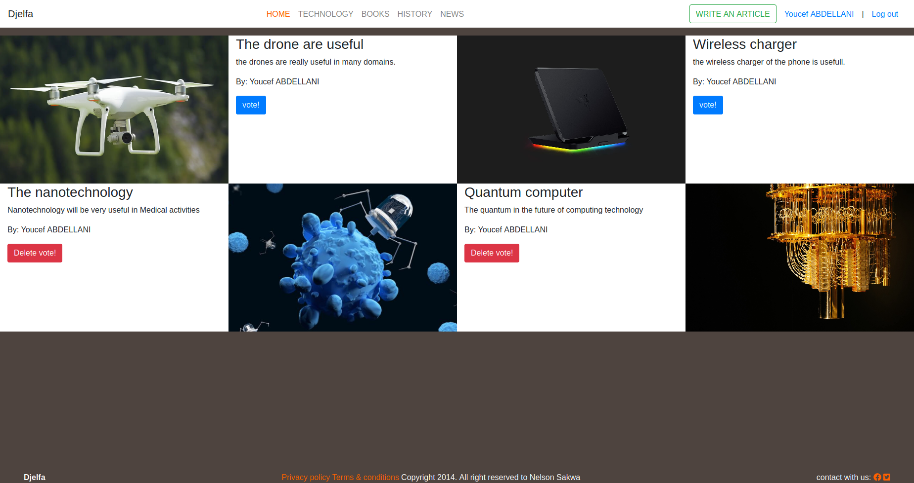

#  🧐 RoR capstone project application

This is the Capstone project on the Ruby on Rails module from the Microverse program. It consists of making a blog in which the user can write an article in the domain of Technology, books, History, and News. He can also vote for an article that he wrote or other users wrote, delete and edit an article that he wrote.



## Live Demo

[Live Demo](https://pure-atoll-25387.herokuapp.com/)


## 🔧 Built With these features
- Ruby. vruby 2.7.0
- Ruby on Rails. v6.0.3.4
- Using Rubocop Linters.
- Bootstrap

## 🛠 Getting Started
## Install 
 In order to run on the local environment, you need to install Ruby on your computer. For windows, you can go to [Ruby installer](https://rubyinstaller.org/) and for MAC and LINUX you can go to [Ruby official site](https://www.ruby-lang.org/en/downloads/) for instructions on how to install it. Then you can clone the project by typing ```git clone https://github.com/ABDELLANI-Youcef/ror_articles_website.git``` on your terminal. You will need also to have Postgresql properly installed to make this application work because it uses Postgres as a database.

## Run the application
To get a local copy up and running follow these simple example steps.

- Open a terminal
- Copy this code: ```git clone "put the link from GitHub repo"```
- Run the program with this code: ``` bundle install```
- before running ```rails server``` you must run a few more commands: first-run ```yarn install --check-files```
- Then run ```rails db:create```, ```rails db:migrate```, ```rails db:seed```
- now you can run ```rails server```
- Stop the program with: "Ctrl + C" (Windows or Linux) or "Command + C"(Apple)

## Open app in browser

- When the program is running go to your browser
- put: localhost:3000/
- Click on login, register, and create a new Event
- Enjoy the app.

## ✒️ Author

👤 **Youcef Abdellani**

- Github: [@ABDELLANI-Youcef](https://github.com/ABDELLANI-Youcef)
- LinkedIn:[LinkedIn](linkedin.com/in/youcef-abdellani)
- Twitter:[@YoucefAbdellani](https://twitter.com/YoucefAbdellani)

## 🤝 Contributing
Contributions, issues, and feature requests are welcome!

Feel free to check the [issues page](https://github.com/ABDELLANI-Youcef/ror_articles_website/issues).

## Acknowledgment

- [Microverse](https://www.microverse.org/)
- [Nelson Sakwa](https://www.behance.net/gallery/14554909/liFEsTlye-Mobile-version)
- [Rails guides](https://guides.rubyonrails.org/)
- [ruby gems](https://rubygems.org)
- [stackoverflow](https://stackoverflow.com/)
- [This tutorial about implementing active storage in rails 6](https://www.youtube.com/watch?v=qHhWXdcDwjI)